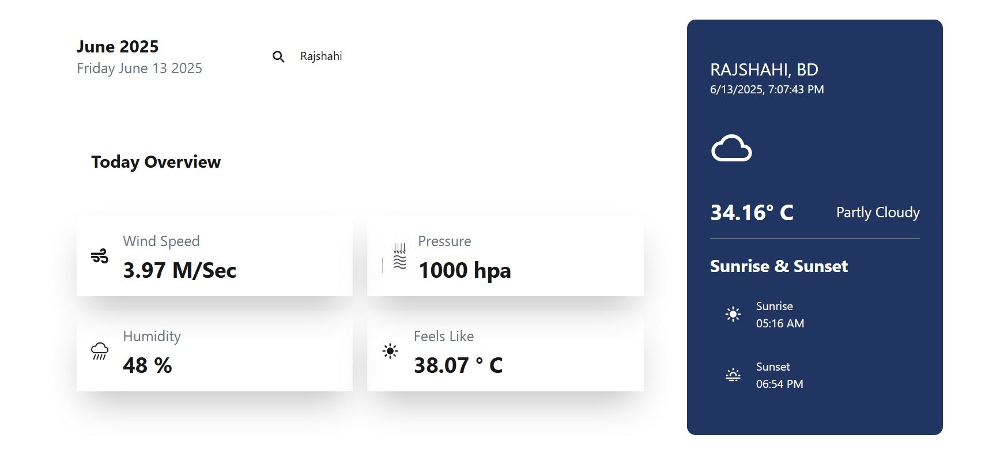

# Project Name: Weather Application


**Live Website:** [Weather App](https://weather-app-nu-nine-92.vercel.app/) 

**Weather Application OverView** 
This weather app lets users search for any city's current weather worldwide.
It shows real-time data like temperature, wind speed, humidity, and pressure.
Users can also view sunrise and sunset times based on the searched location.
If no city is searched, it fetches weather based on the user’s current location.
The UI is clean, responsive, and displays data with relevant weather icons.


 ## 🖼 Screenshot  


## 📖 Table of Contents

- [Features](#features)
- [Technologies Used](#technologies-used)
- [Dependencies used](#dependencies-used)
- [Installation](#installation)


## 🚀Features  

- **Real-Time Weather Data**: Shows temperature, humidity, pressure, and wind speed for any searched city. 
- **Search by Location**: Users can type and search for any city globally to get weather updates. 
- **Auto Geolocation**: Automatically detects user location and shows weather if no input is given.
- **Sunrise & Sunset Time**:Shows accurate sunrise and sunset times of the selected city. 
- **Dynamic Weather Icon**: Changes icon (sun, cloud, etc.) based on cloud coverage 

---

## 🛠️ Tech Used 

1. React.js – Core framework used to build the interactive UI.

2. TypeScript – Provides static typing for better development experience and fewer bugs.

3. Tailwind CSS – For fast, responsive, and utility-first styling.

4. Axios – Handles HTTP requests to fetch weather and geolocation data.

5. OpenWeatherMap API – Supplies real-time weather data and geolocation services.

6. React Icons – Delivers visually appealing weather and UI icons.

7. HTML5 & CSS3 – Standard structure and styling alongside Tailwind.

8. Vite – Fast development build tool for React with optimized bundling.

  ---
## 📦 Dependencies  
The project uses the following npm packages:  
```
   "@tailwindcss/vite": "^4.1.8",
    "axios": "^1.9.0",
    "localforage": "^1.10.0",
    "match-sorter": "^8.0.2",
    "react": "^19.1.0",
    "react-dom": "^19.1.0",
    "react-icons": "^5.5.0",
    "react-router-dom": "^7.6.2",
    "sort-by": "^1.2.0",
    "tailwindcss": "^4.1.8"
```

##  Installation & Setup  
Follow these steps to run the project locally:  

### 1 Clone the Client Repository  
```
git clone https://github.com/mdimranictiu/weather-app.git
cd weather-app
```

### 3 Install Dependencies
```
npm install
```
### 4 Start the Development Server
```
npm run dev
```

 ## Resources & Links
📖 React Documentation: https://react.dev/
📖 Tailwind CSS Documentation: https://tailwindcss.com/
🔥 Firebase: https://firebase.google.com/

📌 Feel free to contribute, report issues, or share your feedback! 🚀


